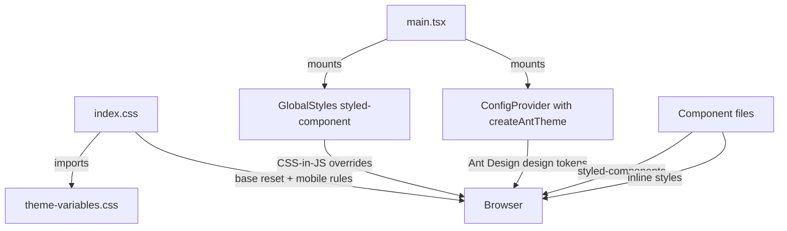
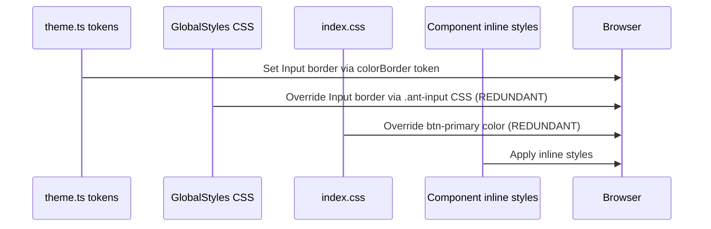
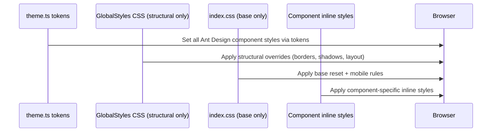

# Design Document: Codebase Refactor

## Overview

This document describes the technical design for a comprehensive refactor of the MilBaant frontend codebase — a React + TypeScript + Vite + Ant Design application with a Supabase backend. The goal is to eliminate dead code, remove redundant styled-components overrides on Ant Design form elements, consolidate global styles to only essential base rules, and improve overall component clarity and consistency without changing any user-visible behavior.

The refactor is purely structural: no new features are added, no APIs change, and no business logic is altered. Every change must leave the application functionally identical while making the code easier to read, maintain, and extend.

## Architecture

The application follows a standard React SPA structure. The styling system has three layers that must be understood before any changes are made:



**Key insight:** Ant Design v6 already accepts full theming via `ConfigProvider` design tokens (`src/styles/theme.ts`). Any CSS class override in `GlobalStyles` that duplicates a token already set in `theme.ts` is redundant and should be removed. The `Input`, `Select`, `DatePicker`, and `InputNumber` components already have their colors, borders, and focus states configured through the `components` section of `createAntTheme`.

## Components and Interfaces

### Layer 1: CSS Variables (`src/styles/theme-variables.css`)

**Status: Keep as-is.** This file is the single source of truth for all CSS custom properties. It is well-structured and complete. No changes needed.

### Layer 2: Ant Design Token Config (`src/styles/theme.ts`)

**Status: Keep as-is.** The `createAntTheme` function correctly configures all Ant Design component tokens including `Input`, `Select`, `DatePicker`, `InputNumber`, `Button`, `Menu`, etc. This is the correct place for Ant Design styling.

### Layer 3: Global Styles (`src/styles/global-styles.ts`)

**Status: Major cleanup required.** This file contains hundreds of lines of CSS class overrides that duplicate what `theme.ts` already handles via tokens. The following sections are redundant and must be removed:

| Section | Reason for removal |
|---|---|
| `.ant-input`, `.ant-input-affix-wrapper`, `.ant-input-number` border rules | Covered by `Input.colorBorder`, `Input.activeBorderColor`, `Input.hoverBorderColor` tokens |
| `.ant-select-selector` border rules | Covered by `Select.colorBorder` token |
| `.ant-picker` border rules | Covered by `DatePicker.colorBorder` token |
| `.ant-input:focus`, `.ant-input-affix-wrapper:focus-within` shadow rules | Covered by `Input.activeShadow` token |
| `.ant-select-focused` shadow rules | Covered by `Select` token |
| `.ant-picker-focused` shadow rules | Covered by `DatePicker.activeShadow` token |
| `.ant-typography`, `h1-h6`, `p`, `span`, `div` color override | Too broad; conflicts with intentional color variations |
| `.ant-typography-secondary`, `.ant-typography-disabled` | Covered by `colorTextSecondary`, `colorTextDisabled` tokens |
| `.ant-tag-*` color variants | Covered by Ant Design's built-in semantic tag colors |
| `.ant-menu-item`, `.ant-menu-item-selected` | Covered by `Menu` component tokens |
| `.ant-pagination-*` | Covered by `Pagination` component tokens |
| `.ant-tabs-*` | Covered by `Tabs` component tokens |
| `.ant-collapse-*` | Covered by `Collapse` component tokens |
| `.ant-segmented-*` | Covered by `Segmented` component tokens |
| `.ant-badge-count` | Covered by `Badge` component tokens |
| `.ant-avatar` | Covered by `Avatar` component tokens |
| `.ant-switch`, `.ant-switch-checked` | Covered by `Switch` component tokens |
| `.ant-checkbox-*`, `.ant-radio-*` | Covered by `Checkbox`/`Radio` component tokens |
| `.ant-slider-*` | Covered by `Slider` component tokens |
| `.ant-progress-*` | Covered by `Progress` component tokens |
| `.ant-statistic-*` | Covered by `Statistic` component tokens |
| `.ant-form-item-label` | Covered by `Form` component tokens |
| `.ant-message-notice-content`, `.ant-notification-notice` | Covered by `Message`/`Notification` tokens |

**Sections to keep in GlobalStyles:**

```
- html, body, #root min-height
- body: margin, overflow-x, font-smoothing, overscroll-behavior
- a { color: inherit }
- * { -webkit-tap-highlight-color: transparent }
- Touch target min-height rules (button, a, [role="button"])
- .ant-btn desktop size override (32px height on md+)
- .ant-card border: none + box-shadow (structural, not color)
- .ant-card-head border-bottom: none (structural)
- .ant-modal-content border: none + box-shadow (structural)
- .ant-modal-header/footer border: none (structural)
- .ant-drawer-header/footer border: none (structural)
- .ant-dropdown-menu border: none + box-shadow (structural)
- .ant-dropdown-menu-item border-radius + margin (structural)
- .ant-popover-inner border: none + box-shadow (structural)
- .ant-table structural rules (transparent bg, border removal, header styling)
- .ant-menu-item width: 100% (layout fix, not covered by tokens)
- .auth-shell specific rules (scoped, not duplicated by tokens)
- Mobile responsive overrides (@media max-width: 767px)
- .ant-btn-dangerous rules (structural border removal)
- .ant-btn-group rules
- .scrollable webkit-overflow-scrolling
- .ant-layout background: transparent
```

### Layer 4: `src/index.css`

**Status: Partial cleanup required.** This file has some redundancy with `GlobalStyles`:

- Keep: font imports, `theme-variables.css` import, `box-sizing: border-box`, `overflow-x: hidden`, mobile touch rules
- Remove: `.ant-btn-primary` color overrides (covered by `Button.colorTextLightSolid` token in `theme.ts`)
- Keep: `.auth-shell .ant-form-item-label > label::after { display: none }` (scoped, valid)
- Keep: `[class*="ant-input-prefix"]` separator removal rules (valid structural fix)
- Keep: `.ant-input-affix-wrapper { border-radius: 8px }` (valid)
- Keep: password icon border removal rules (valid)

### Layer 5: Component Files

**Styled-components usage audit:**

| File | Styled components | Action |
|---|---|---|
| `AppLayout.tsx` | Many (Shell, AppSider, StyledMenu, etc.) | Keep — complex layout components with dynamic props |
| `AuthShell.tsx` | Many (Page, BrandPanel, FormPanel, etc.) | Keep — complex animated layout |
| `BrandLoader.tsx` | Many (Overlay, LogoCircle, etc.) | Keep — animation-heavy |
| `Glass.tsx` | All (PageStack, SectionBlock, etc.) | Keep — shared layout primitives |
| `PageHeader.tsx` | TitleBlock, ActionsBlock | Keep — layout helpers |
| `SummaryStat.tsx` | StatCard, StatValue | Keep — has dynamic `$color` prop |
| `shared/StatCard.tsx` | Card, Label, Value, Subtitle | Keep — has dynamic `$color` prop |
| `ExpenseFormModal.tsx` | UploadArea | Keep — has dynamic `$active` prop |
| `DashboardPage.tsx` | CardWrap, CardBody, CardFooter, CardPoly, AccountNumber, AccountName, BalanceRow | Keep — complex credit card UI with animations |

**Inline style audit (pages):**

Pages like `DashboardPage.tsx` and `ExpensesPage.tsx` use many inline `style={{}}` objects for one-off layout. These are acceptable when:
- They are truly one-off (not repeated)
- They reference CSS variables (`var(--primary)`, etc.)
- They are not overriding Ant Design component internals

Inline styles that should be extracted to styled-components or removed:
- Repeated stat card patterns in `ExpensesPage.tsx` (3 identical `div` blocks with the same structure) → extract to a reusable `MiniStatCard` component
- Repeated `div` wrappers with `background: var(--content-bg); border: 1px solid var(--card-border); border-radius: Xpx` → use `SectionBlock` or `MobileCard` from `Glass.tsx`

## Data Models

No data model changes. This refactor is purely presentational and structural.

## Sequence Diagrams

### Styling Resolution Order (Current vs. Target)

**Current (problematic):**


**Target (clean):**


## Key Functions with Formal Specifications

### `createAntTheme(mode)` — `src/styles/theme.ts`

**Status: No changes needed.**

**Preconditions:**
- `mode` is `'light'` or `'dark'`

**Postconditions:**
- Returns a valid `ThemeConfig` object
- All `Input`, `Select`, `DatePicker`, `InputNumber` component tokens are set
- No CSS class overrides needed for these components after this function runs

### `GlobalStyles` — `src/styles/global-styles.ts`

**Preconditions (after refactor):**
- `theme.ts` tokens are already applied via `ConfigProvider`

**Postconditions (after refactor):**
- Only structural rules remain (border removal, shadow application, layout fixes)
- No color values that duplicate CSS variables already set by tokens
- No rules targeting `.ant-input`, `.ant-select-selector`, `.ant-picker` for color/border styling
- File size reduced by ~60%

### Reusable `MiniStatCard` component (new)

**Purpose:** Replace the 3 repeated inline stat card `div` blocks in `ExpensesPage.tsx`.

```typescript
interface MiniStatCardProps {
  label: string
  value: string
  subtitle: string
  iconBg: string
  iconColor: string
  icon: ReactNode
}
```

**Preconditions:**
- All props are provided

**Postconditions:**
- Renders a consistent stat card matching the existing visual design
- Uses CSS variables for colors, not hardcoded hex values

## Algorithmic Pseudocode

### Refactor Decision Algorithm

```pascal
ALGORITHM shouldRemoveGlobalStyleRule(cssRule)
INPUT: cssRule — a CSS rule targeting an Ant Design class
OUTPUT: shouldRemove — boolean

BEGIN
  // Step 1: Check if rule targets a form input component
  IF cssRule.selector MATCHES ".ant-input|.ant-select|.ant-picker|.ant-input-number" THEN
    // Step 2: Check if the property is already a token
    IF cssRule.property IN ["border", "border-color", "box-shadow", "color", "background"] THEN
      // Step 3: Verify the token exists in theme.ts
      IF tokenExistsInTheme(cssRule.property, cssRule.selector) THEN
        RETURN true  // Remove — token handles it
      END IF
    END IF
  END IF
  
  // Step 4: Check if rule is structural (layout, not color)
  IF cssRule.property IN ["border-radius", "overflow", "display", "width", "height"] THEN
    RETURN false  // Keep — structural rules are valid
  END IF
  
  // Step 5: Check if rule is a broad typography override
  IF cssRule.selector MATCHES "h1|h2|h3|h4|h5|h6|p|span|div" THEN
    IF cssRule.property = "color" THEN
      RETURN true  // Remove — too broad, breaks intentional color variations
    END IF
  END IF
  
  RETURN false  // Keep by default
END
```

**Preconditions:**
- `theme.ts` has been fully reviewed and all relevant tokens identified
- CSS rule is from `GlobalStyles` or `index.css`

**Postconditions:**
- Returns `true` only when the rule is definitively covered by a token
- No false positives (never removes a rule that has no token equivalent)

### Dead Code Detection Algorithm

```pascal
ALGORITHM findDeadCode(file)
INPUT: file — a TypeScript/TSX source file
OUTPUT: deadItems — list of unused symbols

BEGIN
  deadItems ← []
  
  // Check imports
  FOR each importStatement IN file.imports DO
    IF importStatement.symbol NOT USED IN file.body THEN
      deadItems.add(importStatement)
    END IF
  END FOR
  
  // Check commented-out code blocks
  FOR each comment IN file.comments DO
    IF comment.isBlockComment AND comment.containsCode THEN
      deadItems.add(comment)
    END IF
  END FOR
  
  // Check unused state variables
  FOR each useState IN file.hooks DO
    IF useState.setter NOT CALLED AND useState.value NOT READ THEN
      deadItems.add(useState)
    END IF
  END FOR
  
  RETURN deadItems
END
```

## Example Usage

### Before: Redundant GlobalStyles input override

```typescript
// BEFORE — in global-styles.ts (REMOVE THIS)
.ant-input,
.ant-input-affix-wrapper {
  border: 1px solid var(--border-default)  ;
}

.ant-input:focus,
.ant-input-affix-wrapper:focus-within {
  border-color: var(--primary)  ;
  box-shadow: 0 0 0 2px var(--primary-soft)  ;
}
```

```typescript
// AFTER — already handled in theme.ts (KEEP THIS)
Input: {
  colorBorder:       c.borderDefault,
  activeBorderColor: c.primary,
  activeShadow:      `0 0 0 2px ${c.primary}33`,
  hoverBorderColor:  c.secondary,
}
```

### Before: Repeated inline stat card pattern

```typescript
// BEFORE — in ExpensesPage.tsx (3 times, EXTRACT THIS)
<div style={{ background: 'var(--surface)', border: 'none', borderRadius: 12,
  padding: '10px 12px', display: 'flex', alignItems: 'center',
  justifyContent: 'space-between', gap: 10 }}>
  <div>
    <div style={{ fontSize: 11, color: 'var(--text-secondary)', fontWeight: 500 }}>Total Expenses</div>
    <div style={{ fontSize: 15, fontWeight: 700, color: 'var(--text-strong)' }}>{formatCurrency(fixedTotal)}</div>
    <div style={{ fontSize: 10, color: 'var(--text-disabled)' }}>{formatMonthYear(selectedMonth)}</div>
  </div>
  <div style={{ width: 34, height: 34, borderRadius: 10, background: 'var(--primary-soft)',
    display: 'flex', alignItems: 'center', justifyContent: 'center', flexShrink: 0 }}>
    <WalletOutlined style={{ fontSize: 15, color: 'var(--primary)' }} />
  </div>
</div>
```

```typescript
// AFTER — reusable component (SummaryStat already exists, use it)
<SummaryStat
  title="Total Expenses"
  value={formatCurrency(fixedTotal)}
  subtitle={formatMonthYear(selectedMonth)}
  icon={<WalletOutlined />}
  color="var(--primary)"
/>
```

### Before: Broad typography override

```typescript
// BEFORE — in global-styles.ts (REMOVE THIS)
.ant-typography,
h1, h2, h3, h4, h5, h6,
p, span, div {
  color: var(--text-primary);
}
```

```typescript
// AFTER — handled by Ant Design token (KEEP THIS in theme.ts)
token: {
  colorText: c.textPrimary,
}
```

## Correctness Properties

*A property is a characteristic or behavior that should hold true across all valid executions of a system — essentially, a formal statement about what the system should do. Properties serve as the bridge between human-readable specifications and machine-verifiable correctness guarantees.*

### Property 1: No Redundant Form Component CSS Rules

*For any* CSS rule R in `GlobalStyles` that targets an Ant Design form component selector (`.ant-input`, `.ant-select-selector`, `.ant-picker`, `.ant-input-number`) and sets a color, border, or box-shadow property, there SHALL be no equivalent design token in `theme.ts` that already controls that property — i.e., after the refactor, no such redundant rule exists.

**Validates: Requirements 1.1, 1.2, 1.3**

### Property 2: No Unused Imports

*For any* import statement I in any Source_File, the imported symbol SHALL be referenced at least once in that file's body.

**Validates: Requirements 4.1**

### Property 3: No Orphaned Styled-Components

*For any* styled-component S defined in any Source_File, S SHALL have at least one usage site in the codebase.

**Validates: Requirements 5.3**

### Property 4: No Commented-Out Code Blocks

*For any* block comment C in any Source_File, C SHALL NOT contain executable TypeScript or TSX code — i.e., all commented-out code blocks have been removed.

**Validates: Requirements 4.2**

### Property 5: Repeated Inline Patterns Are Extracted

*For any* inline `style={{}}` object O that appears 3 or more times with the same structure in a single file, O SHALL be extracted to a named component invocation rather than repeated inline.

**Validates: Requirements 3.1, 3.2, 3.3**

### Property 6: TypeScript Validity

*For any* Source_File F after the refactor, the TypeScript compiler SHALL report zero type errors for F.

**Validates: Requirements 7.1**

## Error Handling

### Risk: Removing a GlobalStyles rule that IS needed

**Condition:** A CSS rule appears redundant but actually compensates for a bug or gap in the Ant Design token system for v6.

**Mitigation:** Before removing any rule, verify the visual output in both light and dark mode. Keep a checklist of removed rules. If a visual regression appears, restore the specific rule and add a comment explaining why it cannot be removed.

**Recovery:** Git history preserves all removed rules. Any regression can be fixed by restoring the specific rule with a comment: `/* Cannot remove: token X does not cover Y in antd v6 */`

### Risk: Breaking the auth shell styling

**Condition:** The `.auth-shell` scoped rules in `GlobalStyles` and `index.css` are removed accidentally.

**Mitigation:** These rules are clearly scoped to `.auth-shell` and are not duplicated by tokens. They must be kept. Mark them with a comment: `/* Scoped to auth pages — do not remove */`

### Risk: Inline style removal breaks layout

**Condition:** An inline style that appears redundant is actually providing a critical layout constraint.

**Mitigation:** Only extract inline styles to components when the structure is repeated 3+ times. Never remove a one-off inline style unless it is provably unused (e.g., `style={{ display: 'none' }}` on a visible element).

## Testing Strategy

### Unit Testing Approach

No unit tests are required for this refactor since no logic changes. The primary verification method is visual regression testing.

### Visual Regression Checklist

For each page, verify in both light and dark mode:

1. **Login / Register pages** — form inputs have correct border, focus ring, placeholder color
2. **Dashboard** — stat cards, credit card widget, announcements, flat fund section
3. **Expenses page** — tables, mobile cards, stat row, modals
4. **All other pages** — general layout, tables, forms, buttons

### Property-Based Testing Approach

Not applicable for a styling refactor. The correctness properties above serve as the verification criteria.

### Integration Testing Approach

Run the application locally and navigate through all routes. Verify:
- No console errors related to styled-components or CSS
- No visual regressions in form elements (inputs, selects, date pickers)
- Dark/light mode toggle works correctly on all pages
- Mobile responsive layout is preserved

## Performance Considerations

Removing ~60% of `GlobalStyles` content reduces the CSS-in-JS bundle size and eliminates redundant style recalculations. The `styled-components` runtime will inject fewer rules into the document, which marginally improves paint performance.

Extracting repeated inline style objects to named components also reduces React's reconciliation work since object identity is stable across renders.

## Security Considerations

No security implications. This is a purely presentational refactor.

## Dependencies

No new dependencies are introduced. The refactor may allow removal of `@types/styled-components` if styled-components usage is significantly reduced, but this is out of scope for this refactor — styled-components is legitimately used for complex animated and dynamic components.

Files that will be modified:
- `src/styles/global-styles.ts` — major cleanup
- `src/index.css` — minor cleanup
- `src/pages/ExpensesPage.tsx` — extract repeated stat card pattern
- `src/pages/DashboardPage.tsx` — remove dead commented-out code, clean inline styles
- Other page files — remove unused imports, dead commented-out code blocks
