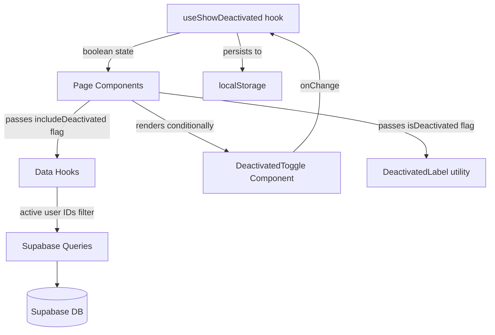

# Design Document

## Deactivated User Data Visibility

### Overview

This feature adds a data visibility layer to the MilBaant flatmate expense management application. When a user is deactivated (`is_active = false`), their data is hidden by default across all views — expenses, rides, cook ledger, contributions, announcements, activity logs, and the flat view. Administrators can toggle visibility of deactivated users' historical data on a per-session basis, with the preference persisted in `localStorage`.

The design is intentionally minimal: no new database tables are required. The `is_active` column already exists on `profiles`. The feature is implemented entirely in the React/TypeScript frontend through:

1. A shared `useShowDeactivated` hook that reads/writes the preference from `localStorage`
2. A `useActiveProfiles` hook that filters the profiles list based on the toggle state
3. Updated data-fetching hooks that accept an `includeDeactivated` flag and apply Supabase `.in()` filters at the query level
4. A reusable `DeactivatedToggle` component rendered in page headers for admin users
5. Visual distinction utilities applied when deactivated records are shown

### Architecture



The filtering strategy is **client-side query filtering using active user IDs**: the frontend fetches the full profiles list (which is small and already cached), extracts the IDs of active users, and passes them as an `.in()` filter to each data query. This avoids any database schema changes or new RLS policies while keeping filtering at the query level rather than in JavaScript array operations on the returned data.

**Why not server-side RLS filtering?** RLS policies would require separate policy variants for "show all" vs "hide deactivated" modes, which would need to be toggled per-request — not feasible with Supabase's static RLS model. The active user ID list is small (typically < 20 users) and already cached via React Query, making the `.in()` approach both correct and performant.

**Why not post-fetch JavaScript filtering?** Requirement 6.5 specifies filtering at the database query level. The `.in()` approach satisfies this: the filter is part of the Supabase query builder and is sent as a SQL `WHERE user_id IN (...)` clause, not applied after data is returned.

### Components and Interfaces

#### `useShowDeactivated` Hook

```typescript
// src/hooks/useShowDeactivated.ts

const STORAGE_KEY = 'milbaant_show_deactivated'

export function useShowDeactivated(): [boolean, (value: boolean) => void] {
  const [show, setShow] = useState<boolean>(() => {
    try {
      const stored = localStorage.getItem(STORAGE_KEY)
      return stored === 'true'
    } catch {
      return false  // default: hide deactivated
    }
  })

  const toggle = useCallback((value: boolean) => {
    setShow(value)
    try {
      localStorage.setItem(STORAGE_KEY, String(value))
    } catch {
      // Storage failure: continue with in-memory state only
    }
  }, [])

  return [show, toggle]
}
```

- Default value: `false` (hide deactivated)
- Storage key: `'milbaant_show_deactivated'`
- Storage failures are caught and silently ignored; the in-memory state continues to work

#### `useActiveProfiles` Hook

```typescript
// src/hooks/useActiveProfiles.ts

export function useActiveProfiles(includeDeactivated = false): Profile[] {
  const profilesQuery = useProfiles()
  const profiles = profilesQuery.data ?? []
  if (includeDeactivated) return profiles
  return profiles.filter((p) => p.is_active !== false)
}

export function useActiveProfileIds(includeDeactivated = false): string[] {
  return useActiveProfiles(includeDeactivated).map((p) => p.id)
}
```

This hook is the single source of truth for which profiles are "visible". It is used both for rendering user lists and for constructing the `.in()` filter passed to data hooks.

#### Updated Data Hook Signatures

Each data-fetching hook gains an optional `activeUserIds` parameter. When provided (and not `undefined`), the query applies `.in('created_by', activeUserIds)` (or the appropriate column). When `undefined`, no filter is applied (used by the Admin page and user-selection dropdowns).

```typescript
// Pattern applied to all data hooks:
export function useExpenses(month: Dayjs, activeUserIds?: string[])
export function useRides(month: Dayjs, activeUserIds?: string[])
export function useCookAdvances(activeUserIds?: string[])
export function useCookPurchases(activeUserIds?: string[])
export function useContributionPayments(month: string, activeUserIds?: string[])
export function useAnnouncements(activeUserIds?: string[])
export function useActivityLogs(activeUserIds?: string[])
export function useBedAssignments(activeUserIds?: string[])
```

The `activeUserIds` array is derived from `useActiveProfileIds(showDeactivated)` in each page component and passed down to the hooks. This keeps the filtering logic in one place (the hook) while the toggle state lives in the page.

**Query key changes**: The `activeUserIds` array (or a boolean derived from it) must be included in the React Query key so that toggling the visibility causes a cache miss and re-fetch:

```typescript
queryKey: [...QUERY_KEYS.expenses, month.format('YYYY-MM'), activeUserIds ?? 'all']
```

#### `DeactivatedToggle` Component

```typescript
// src/components/DeactivatedToggle.tsx

interface DeactivatedToggleProps {
  value: boolean
  onChange: (value: boolean) => void
}

export function DeactivatedToggle({ value, onChange }: DeactivatedToggleProps) {
  return (
    <Flex align="center" gap={8}>
      <Switch
        size="small"
        checked={value}
        onChange={onChange}
      />
      <Typography.Text style={{ fontSize: 13, color: 'var(--text-muted)' }}>
        {value ? 'Hide Deactivated Users' : 'Show Deactivated Users'}
      </Typography.Text>
    </Flex>
  )
}
```

This component is rendered inside the `actions` prop of `PageHeader` on each affected page, but only when `isAdmin` is true.

#### Visual Distinction Utilities

```typescript
// src/lib/ui-helpers.ts (additions)

/**
 * Returns style props for rendering a deactivated user's name.
 * Apply to Typography.Text or similar elements.
 */
export function deactivatedNameStyle(): React.CSSProperties {
  return { opacity: 0.45, color: 'var(--text-muted)' }
}

/**
 * Formats a user's display name, appending "(Deactivated)" if inactive.
 */
export function formatUserName(
  name: string | null | undefined,
  isActive: boolean | undefined,
): string {
  const base = name ?? 'Unknown'
  return isActive === false ? `${base} (Deactivated)` : base
}
```

These utilities are used in table cell renderers and participant tag lists when `showDeactivated` is true.

#### User Selection Dropdowns

User selection dropdowns (expense participants, ride riders, cook advance giver, contribution payment user) always use `useActiveProfiles(false)` — they never include deactivated users regardless of the admin toggle state. This is enforced by passing `false` explicitly rather than reading from `useShowDeactivated`.

### Data Models

No new database tables or columns are required. The existing `profiles.is_active` boolean column (already present and indexed) is the sole data model change needed.

**Existing relevant schema:**

```sql
-- Already exists:
ALTER TABLE public.profiles ADD COLUMN IF NOT EXISTS is_active boolean NOT NULL DEFAULT true;
CREATE INDEX IF NOT EXISTS profiles_is_active_idx ON public.profiles (is_active);
```

**TypeScript type update** — `is_active` is already optional on `Profile`:

```typescript
export interface Profile {
  id: string
  full_name: string
  role: Role
  can_add_expenses: boolean
  is_active?: boolean   // already present
  avatar_url?: string | null
  phone?: string | null
  bio?: string | null
}
```

No migration is needed. The `is_active` column and index are already deployed.

**Filter application per table:**

| Table | Filter column(s) | Notes |
|---|---|---|
| `expenses` | `created_by` | Also filter `expense_participants.user_id` via joined data |
| `expense_participants` | `user_id` | Filtered via the joined expense query |
| `rides` | `created_by`, `paid_by` | Both columns must reference active users |
| `ride_riders` | `user_id` | Filtered via the joined ride query |
| `cook_advances` | `given_by` | |
| `cook_purchases` | `created_by` | |
| `contribution_payments` | `user_id` | |
| `announcements` | `created_by` | |
| `activity_logs` | `user_id` | |
| `bed_assignments` | `user_id` | |

**Balance calculation changes:**

`buildMonthlyUserSummary` in `src/lib/expense-helpers.ts` currently accepts a `profiles` array. When deactivated data is hidden, only active profiles are passed to this function. No changes to the function signature are needed — the caller filters the profiles before passing them.

The `perMemberShare` calculation uses `memberCountQuery.data` (a stored setting). This setting is managed manually by admins and is not automatically derived from the active profile count. The requirements specify that the calculation should divide by active user count when deactivated data is hidden. This means `calculatePerMemberShare` will need to receive the active profile count rather than the stored member count setting when `showDeactivated` is false.

### Correctness Properties

*A property is a characteristic or behavior that should hold true across all valid executions of a system — essentially, a formal statement about what the system should do. Properties serve as the bridge between human-readable specifications and machine-verifiable correctness guarantees.*

#### Property 1: Active-only filter excludes all deactivated records

*For any* list of records (expenses, rides, cook advances, cook purchases, contribution payments, announcements, activity logs) and any set of profiles with a mix of active and deactivated users, applying the data filter with `showDeactivated = false` SHALL produce a result set where every record's owner/creator field references only an active user ID.

**Validates: Requirements 1.1, 1.2, 1.3, 1.4, 1.5, 1.6, 1.7, 9.3, 10.1, 10.2, 11.1, 11.2, 12.1, 12.2**

#### Property 2: Show-all filter is identity

*For any* list of records and any set of profiles, applying the data filter with `showDeactivated = true` SHALL return the complete original record set unchanged.

**Validates: Requirements 2.7, 9.4, 10.4, 11.4, 12.3, 12.4**

#### Property 3: User list filtering excludes deactivated profiles

*For any* list of profiles containing a mix of active and deactivated users, `useActiveProfiles(false)` SHALL return only profiles where `is_active !== false`, and the result SHALL be a strict subset of the input.

**Validates: Requirements 1.9, 1.8**

#### Property 4: Deactivated name formatting appends label

*For any* user name string and `isActive = false`, `formatUserName(name, false)` SHALL return a string that ends with `" (Deactivated)"` and contains the original name as a prefix.

**Validates: Requirements 3.5**

#### Property 5: Visibility preference round-trip

*For any* boolean value written to `useShowDeactivated`, reading the preference back from `localStorage` using the same storage key SHALL return the same boolean value.

**Validates: Requirements 4.1, 4.2, 4.4**

#### Property 6: Toggle label reflects state

*For any* boolean toggle state, the `DeactivatedToggle` component SHALL display `"Hide Deactivated Users"` when `value = true` and `"Show Deactivated Users"` when `value = false`.

**Validates: Requirements 8.1, 8.2**

#### Property 7: Balance calculation uses active profile count

*For any* set of profiles with at least one deactivated user, when `showDeactivated = false`, the per-member share calculation SHALL divide the fixed total by the count of active profiles only, not the total profile count.

**Validates: Requirements 9.1**

#### Property 8: User selection dropdowns always show only active users

*For any* profile list with mixed active/deactivated users, the options returned for user selection dropdowns SHALL contain only profiles where `is_active !== false`, regardless of the current `showDeactivated` toggle state.

**Validates: Requirements 13.1, 13.2, 13.3, 13.4, 13.5**

### Error Handling

**Storage failures (Requirement 15.3, 15.4):**
Both `localStorage.getItem` and `localStorage.setItem` calls in `useShowDeactivated` are wrapped in `try/catch`. On read failure, the hook defaults to `false` (hide deactivated). On write failure, the in-memory state is still updated so the toggle works for the current session.

**Query errors (Requirement 15.1, 15.2):**
Data hooks already propagate errors through React Query's `error` state. The existing `QueryState` component renders error messages when `error` is non-null. No additional error handling is needed for the filter itself — if the profiles query fails, `activeUserIds` will be an empty array, which would cause all data to be hidden. To prevent this, the filter should only be applied when the profiles query has successfully returned data:

```typescript
// In page components:
const profilesQuery = useProfiles()
const activeUserIds = profilesQuery.isSuccess
  ? useActiveProfileIds(showDeactivated)
  : undefined  // undefined = no filter applied (show all)
```

This satisfies Requirement 15.5: if the filter fails to apply (profiles query error), unfiltered data is shown rather than no data.

**Deactivated user joins:**
When `showDeactivated = true`, records from deactivated users are shown. Their joined `profile` data (e.g., `creator`, `payer`) will be present since the profiles table still contains their rows. No special handling is needed for orphaned references.

### Testing Strategy

This feature involves UI state management, client-side filtering logic, and localStorage persistence. Property-based testing is appropriate for the pure filtering and formatting functions.

**Property-based testing library:** [fast-check](https://fast-check.dev/) — already a common choice for TypeScript/React projects.

**Unit tests (example-based):**
- `DeactivatedToggle` renders correct label for each state
- `useShowDeactivated` defaults to `false` when no stored value exists
- `useShowDeactivated` defaults to `false` when storage throws
- Admin pages show the toggle; non-admin pages do not
- Admin page always shows all profiles regardless of toggle
- Admin page does not render the toggle control

**Property-based tests (minimum 100 iterations each):**

Each property test references its design property via a comment tag:
`// Feature: deactivated-user-data-visibility, Property N: <property text>`

- **Property 1** — `filterRecordsByActiveUsers(records, activeIds)` returns only records whose owner field is in `activeIds`, for any randomly generated record list and active ID set
- **Property 2** — `filterRecordsByActiveUsers(records, undefined)` returns the original records unchanged, for any randomly generated record list
- **Property 3** — `filterProfiles(profiles, false)` returns only profiles with `is_active !== false`, for any randomly generated profile list
- **Property 4** — `formatUserName(name, false)` always ends with `" (Deactivated)"` and starts with the original name, for any randomly generated name string
- **Property 5** — Writing then reading from the `useShowDeactivated` storage key always returns the same value, for any randomly generated boolean
- **Property 6** — `DeactivatedToggle` label is `"Hide Deactivated Users"` iff `value = true`, for any boolean value
- **Property 7** — Per-member share equals `total / activeCount` for any randomly generated profile list and expense total
- **Property 8** — Dropdown profile options never include deactivated profiles regardless of toggle state, for any randomly generated profile list and toggle state

**Integration tests:**
- Supabase query with `.in('created_by', activeIds)` returns only matching rows (requires test database)
- Query performance: filtered queries complete within 500ms (Requirement 6.x)

**Pages to update (smoke/manual verification):**
- Dashboard (`/`) — toggle in header, balance table filtered
- Expenses (`/expenses`) — toggle in header, expense and summary tables filtered
- Weekend Expenses (`/weekend-expenses`) — toggle in header
- Rides (`/rides`) — toggle in header, ride table and debt summary filtered
- Cook Ledger (`/cook`) — toggle in header, advances and purchases filtered
- Contributions (`/contributions`) — toggle in header, payments filtered
- Flat View (`/flat-view`) — toggle in header, bed assignments filtered
- Announcements (`/announcements`) — toggle in header
- Activity Logs (`/logs`) — toggle in header
- Admin (`/admin`) — no toggle, always shows all users
